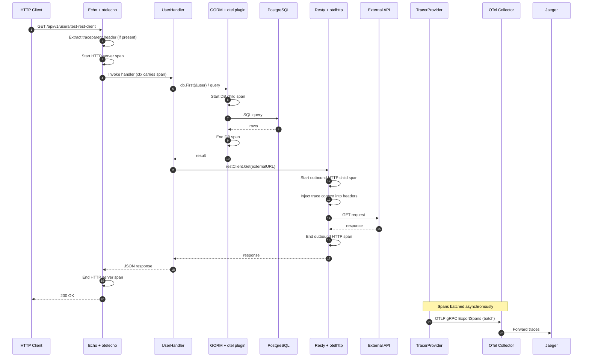
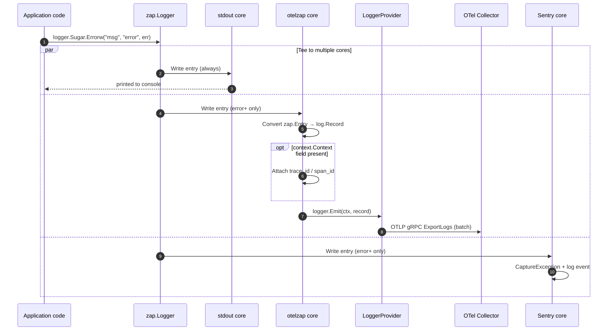
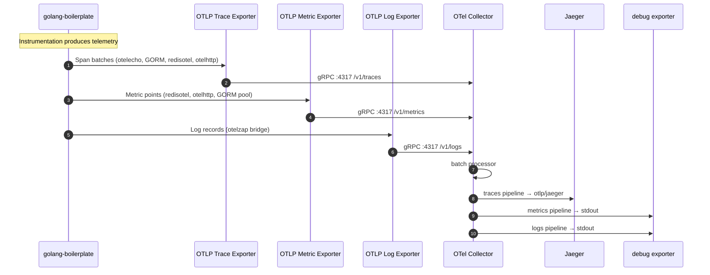
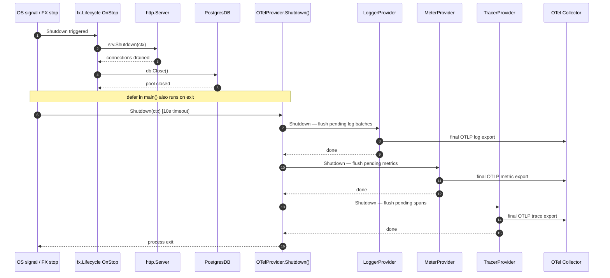

# OpenTelemetry Guide

This project exports **traces**, **metrics**, and **logs** over OTLP. Instrumentation is optional: if `OTEL_EXPORTER_OTLP_ENDPOINT` is empty, OpenTelemetry is skipped (same pattern as New Relic and Sentry).

OpenTelemetry runs alongside existing observability tools:

| Signal | Backend | Notes |
| ------ | ------- | ----- |
| Traces | OTLP → collector → Jaeger (local) | HTTP, GORM, Redis, outbound HTTP |
| Metrics | OTLP → collector | Redis client metrics, HTTP metrics |
| Logs | OTLP → collector | Zap `error`+ via `otelzap` bridge |
| Errors | Sentry | Separate from OTel logs |
| APM | New Relic | Separate from OTel traces |

## Table of Contents

- [Architecture](#architecture)
- [Sequence Flows](#sequence-flows)
  - [1. Application Startup](#1-application-startup)
  - [2. HTTP Request Trace](#2-http-request-trace)
  - [3. Zap Error Log Export](#3-zap-error-log-export)
  - [4. OTLP Export Pipeline](#4-otlp-export-pipeline)
  - [5. Graceful Shutdown](#5-graceful-shutdown)
- [Quick Start (Local)](#quick-start-local)
- [Configuration](#configuration)
- [What Is Instrumented](#what-is-instrumented)
- [Zap Log Export](#zap-log-export)
- [Trace Correlation](#trace-correlation)
- [Docker Compose Stack](#docker-compose-stack)
- [Production Notes](#production-notes)
- [Troubleshooting](#troubleshooting)
- [Related Files](#related-files)

## Architecture

```text
Application
  ├─ Echo (otelecho)           → HTTP server spans
  ├─ GORM (otel plugin)        → DB query spans
  ├─ Redis (redisotel)         → cache spans + metrics
  ├─ Resty (otelhttp)          → outbound HTTP spans
  └─ Zap (otelzap bridge)      → OTLP log records (error+)

        │ OTLP gRPC/HTTP
        ▼
OpenTelemetry Collector (localhost:4317)
  ├─ traces  → Jaeger
  ├─ metrics → debug exporter (stdout)
  └─ logs    → debug exporter (stdout)
```

Initialization order in `cmd/server/main.go`:

1. `logger.Init()` — stdout zap logger
2. `monitoring.InitNewRelic()` / `monitoring.InitSentry()`
3. `monitoring.InitOpenTelemetry()` — tracer, meter, and logger providers
4. `monitoring.AttachOTelZapLogger()` — tee OTel zap core for error logs
5. Sentry zap core attached (errors also go to Sentry)

## Sequence Flows

### 1. Application Startup

How OpenTelemetry is initialized when the server boots (`cmd/server/main.go`).

```mermaid
sequenceDiagram
    autonumber
    participant Main as main()
    participant Config as config.Load()
    participant Logger as logger.Init()
    participant NR as InitNewRelic()
    participant Sentry as InitSentry()
    participant OTel as InitOpenTelemetry()
    participant Zap as AttachOTelZapLogger()
    participant FX as fx.New()

    Main->>Config: Load .env / env vars
    Config-->>Main: *Config (OTEL_* settings)

    Main->>Logger: Init(logLevel, appEnv)
    Logger-->>Main: stdout zap core ready

    Main->>NR: InitNewRelic(cfg)
    NR-->>Main: *newrelic.Application | nil

    Main->>Sentry: InitSentry(cfg)
    Sentry-->>Main: Sentry client ready | skip

    Main->>OTel: InitOpenTelemetry(cfg)

    alt OTEL_EXPORTER_OTLP_ENDPOINT is empty
        OTel-->>Main: nil (OTel disabled)
    else OTEL_EXPORTER_OTLP_ENDPOINT is set
        OTel->>OTel: Create resource (service.name, version, env)
        OTel->>OTel: Set W3C TraceContext + Baggage propagators
        opt OTEL_TRACES_ENABLED
            OTel->>OTel: TracerProvider + OTLP trace exporter
        end
        opt OTEL_METRICS_ENABLED
            OTel->>OTel: MeterProvider + OTLP metric exporter
        end
        opt OTEL_LOGS_ENABLED
            OTel->>OTel: LoggerProvider + OTLP log exporter
        end
        OTel-->>Main: *OTelProvider
    end

    opt OTEL_LOGS_ENABLED
        Main->>Zap: AttachOTelZapLogger(loggerProvider)
        Zap->>Logger: Tee otelzap core (error+ only)
    end

    Main->>Logger: Tee Sentry core (error+ only)

    Main->>FX: Supply cfg, nrApp; Provide handlers, db, cache...
    FX-->>Main: HTTP server running
```

### 2. HTTP Request Trace

End-to-end trace for a request that hits the DB and an outbound HTTP call (e.g. `GET /api/v1/users/test-rest-client`).



> **Note:** GORM spans nest under the HTTP span only when repositories use `db.WithContext(ctx)`. Redis spans link correctly when cache methods receive the request context.

### 3. Zap Error Log Export

How an error log travels from zap to the collector (parallel to stdout and Sentry).



### 4. OTLP Export Pipeline

How the three signals leave the app and are routed by the local collector.



### 5. Graceful Shutdown

Telemetry flush when the process exits (FX `OnStop` hook + deferred shutdown).



## Quick Start (Local)

### 1. Start the observability stack

```bash
make otel-up
```

This starts:

- **Jaeger UI** — http://localhost:16686
- **OTel Collector** — OTLP on `localhost:4317` (gRPC) and `localhost:4318` (HTTP)

### 2. Configure environment

Add to `cmd/server/.env` (see `examples/env/server.env.example`):

```bash
OTEL_SERVICE_NAME=golang-boilerplate
OTEL_EXPORTER_OTLP_ENDPOINT=localhost:4317
OTEL_EXPORTER_OTLP_PROTOCOL=grpc
OTEL_EXPORTER_OTLP_INSECURE=true
OTEL_TRACES_ENABLED=true
OTEL_METRICS_ENABLED=true
OTEL_LOGS_ENABLED=true
```

### 3. Run the app

```bash
make up
```

### 4. Generate traffic

```bash
curl http://localhost:3000/api/v1/
curl -H "Authorization: Bearer <token>" http://localhost:3000/api/v1/users/test-rest-client
```

### 5. View telemetry

| Signal | Where to look |
| ------ | --------------- |
| Traces | Jaeger UI — http://localhost:16686 |
| Metrics | `docker compose logs -f otel-collector` |
| Logs | `docker compose logs -f otel-collector` |

### Stop the stack

```bash
make otel-down
```

## Configuration

All settings are loaded from environment variables in `internal/config/config.go`.

| Variable | Default | Description |
| -------- | ------- | ----------- |
| `OTEL_SERVICE_NAME` | `APP_NAME` or `golang-boilerplate` | `service.name` resource attribute |
| `OTEL_EXPORTER_OTLP_ENDPOINT` | *(empty = disabled)* | OTLP collector endpoint |
| `OTEL_EXPORTER_OTLP_PROTOCOL` | `grpc` | `grpc` or `http/protobuf` |
| `OTEL_EXPORTER_OTLP_INSECURE` | `false` | Skip TLS (use `true` for local dev) |
| `OTEL_TRACES_ENABLED` | `true` | Export distributed traces |
| `OTEL_METRICS_ENABLED` | `true` | Export metrics |
| `OTEL_LOGS_ENABLED` | `true` | Export zap error logs over OTLP |

### gRPC endpoint examples

```bash
OTEL_EXPORTER_OTLP_ENDPOINT=localhost:4317
OTEL_EXPORTER_OTLP_PROTOCOL=grpc
OTEL_EXPORTER_OTLP_INSECURE=true
```

### HTTP endpoint examples

```bash
OTEL_EXPORTER_OTLP_ENDPOINT=http://localhost:4318
OTEL_EXPORTER_OTLP_PROTOCOL=http/protobuf
OTEL_EXPORTER_OTLP_INSECURE=true
```

### Disable individual signals

```bash
OTEL_TRACES_ENABLED=false   # traces off, metrics/logs still on
OTEL_METRICS_ENABLED=false
OTEL_LOGS_ENABLED=false
```

## What Is Instrumented

### HTTP server (Echo)

**File:** `cmd/server/routes/router.go`

Uses `go.opentelemetry.io/contrib/instrumentation/github.com/labstack/echo/otelecho`.

- Creates a span per incoming request
- Extracts/injects W3C Trace Context and Baggage headers
- Enabled when `OTEL_EXPORTER_OTLP_ENDPOINT` is set and `OTEL_TRACES_ENABLED=true`

### GORM / PostgreSQL

**File:** `internal/db/manager.go`

Uses `gorm.io/plugin/opentelemetry/tracing`.

- Traces `Create`, `Query`, `Update`, `Delete`, `Row`, `Raw`
- Sets `db.system=postgresql`
- Emits DB pool metrics unless `OTEL_METRICS_ENABLED=false`

### Redis

**File:** `internal/cache/redis.go`

Uses `github.com/redis/go-redis/extra/redisotel/v9`.

- `InstrumentTracing()` — span per Redis command (when traces enabled)
- `InstrumentMetrics()` — client metrics (when metrics enabled)
- Requires `context.Context` on cache calls for parent span linking

### Outbound HTTP (Resty)

**File:** `internal/httpclient/resty.go`

Uses `go.opentelemetry.io/contrib/instrumentation/net/http/otelhttp`.

- Wraps the Resty transport
- Traces outbound calls (Keycloak, test endpoints, etc.)

## Zap Log Export

Zap logs are exported to OTLP using the official bridge `go.opentelemetry.io/contrib/bridges/otelzap`.

**Files:** `internal/monitoring/otel_zap.go`, `cmd/server/main.go`

### How it works

```text
logger.Sugar.Error(...)
  ├─ stdout core (always)
  ├─ OTel zap core → OTLP logs (error, fatal, panic)
  └─ Sentry core   → Sentry (error, fatal, panic)
```

Only **error-level and above** are sent to OpenTelemetry (same threshold as Sentry). Info and debug logs stay on stdout only.

### Basic usage

No API change — use the global logger as usual:

```go
import "golang-boilerplate/internal/logger"

logger.Sugar.Errorw("database connection failed", "error", err)

logger.Log.Error("request failed",
    zap.String("path", "/api/v1/users"),
    zap.Error(err),
)
```

### Export more log levels

Change the levels passed in `cmd/server/main.go`:

```go
monitoring.AttachOTelZapLogger(otelProvider.LoggerProvider(), []zapcore.Level{
    zapcore.WarnLevel,
    zapcore.ErrorLevel,
    zapcore.FatalLevel,
    zapcore.PanicLevel,
})
```

## Trace Correlation

### Logs ↔ traces

The `otelzap` bridge links logs to traces when you pass `context.Context` as a zap field:

```go
logger.Log.Error("request failed",
    zap.Any("", ctx), // value must be context.Context
    zap.Error(err),
)
```

The bridge detects any field whose value is `context.Context` and attaches the active trace to the log record.

### Redis ↔ traces

Cache methods already accept `context.Context`. Pass the request context from handlers/services:

```go
value, err := cache.Get(c.Request().Context(), key)
```

### GORM ↔ traces

Repositories currently call GORM without `db.WithContext(ctx)`. DB spans are created but may not nest under the HTTP span until repositories pass request context:

```go
db.WithContext(ctx).First(&entity, "id = ?", id)
```

## Docker Compose Stack

Defined in `docker-compose.yml`:

| Service | Image | Ports | Role |
| ------- | ----- | ----- | ---- |
| `jaeger` | `jaegertracing/all-in-one:1.64.0` | `16686` | Trace UI |
| `otel-collector` | `otel/opentelemetry-collector-contrib:0.120.0` | `4317`, `4318` | Receives OTLP from the app |

Collector config: `deploy/otel/otel-collector-config.yaml`

```yaml
traces  → otlp/jaeger (Jaeger backend)
metrics → debug (collector stdout)
logs    → debug (collector stdout)
```

### Makefile targets

```bash
make otel-up    # start jaeger + otel-collector
make otel-down  # stop jaeger + otel-collector
```

### App running inside Docker

If the app runs in a container on the same Compose network, point at the collector service name instead of `localhost`:

```bash
OTEL_EXPORTER_OTLP_ENDPOINT=otel-collector:4317
OTEL_EXPORTER_OTLP_INSECURE=true
```

## Production Notes

1. **Use a managed collector or observability backend** — point `OTEL_EXPORTER_OTLP_ENDPOINT` at your vendor (Datadog, Grafana Cloud, Honeycomb, etc.) or a self-hosted OTel Collector.
2. **Enable TLS** — set `OTEL_EXPORTER_OTLP_INSECURE=false` and use `https://` endpoints where required.
3. **Set `OTEL_SERVICE_NAME`** — use a stable service identifier per deployment.
4. **Sampling** — the default exports all traces. Add a sampler in `internal/monitoring/otel.go` for high-traffic production workloads.
5. **Logs backend** — configure the collector to export logs to Loki, SigNoz, or your vendor instead of the `debug` exporter used locally.
6. **Graceful shutdown** — `OTelProvider.Shutdown()` is called on process exit to flush batched telemetry.

## Troubleshooting

### OpenTelemetry not initializing

Check startup logs for:

```text
OpenTelemetry OTLP endpoint not provided, skipping OpenTelemetry initialization
```

Set `OTEL_EXPORTER_OTLP_ENDPOINT`.

### No traces in Jaeger

1. Confirm `OTEL_TRACES_ENABLED=true`
2. Confirm collector is running: `docker compose ps otel-collector jaeger`
3. Hit an instrumented endpoint (not only static assets)
4. Wait a few seconds — spans are batched before export

### No logs in collector output

1. Confirm `OTEL_LOGS_ENABLED=true`
2. Emit an **error** log (info/debug are not exported to OTel)
3. Tail collector logs: `docker compose logs -f otel-collector`

### Redis spans not linked to HTTP span

Pass request context into cache calls (see [Trace Correlation](#trace-correlation)).

### Connection refused to collector

```bash
# Verify collector is listening
curl -v telnet://localhost:4317

# Or restart the stack
make otel-down && make otel-up
```

## Related Files

| File | Purpose |
| ---- | ------- |
| `internal/monitoring/otel.go` | OTLP exporters, tracer/meter/logger providers |
| `internal/monitoring/otel_zap.go` | Zap → OTLP log bridge |
| `cmd/server/main.go` | Init and shutdown wiring |
| `cmd/server/routes/router.go` | Echo HTTP middleware |
| `internal/db/manager.go` | GORM tracing plugin |
| `internal/cache/redis.go` | Redis tracing and metrics |
| `internal/httpclient/resty.go` | Outbound HTTP tracing |
| `deploy/otel/otel-collector-config.yaml` | Local collector pipelines |
| `docker-compose.yml` | Jaeger + collector services |
| `examples/env/server.env.example` | Environment variable template |
